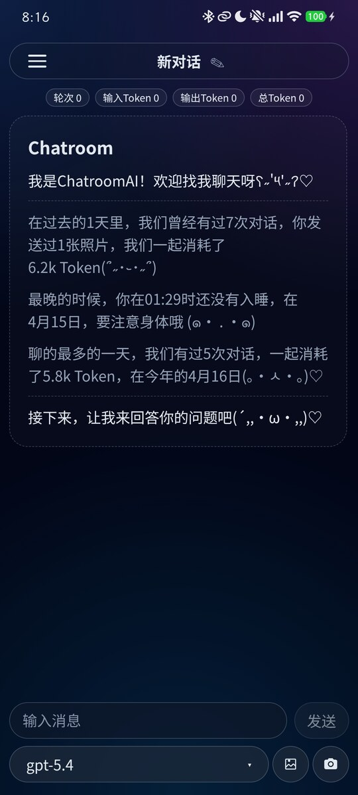
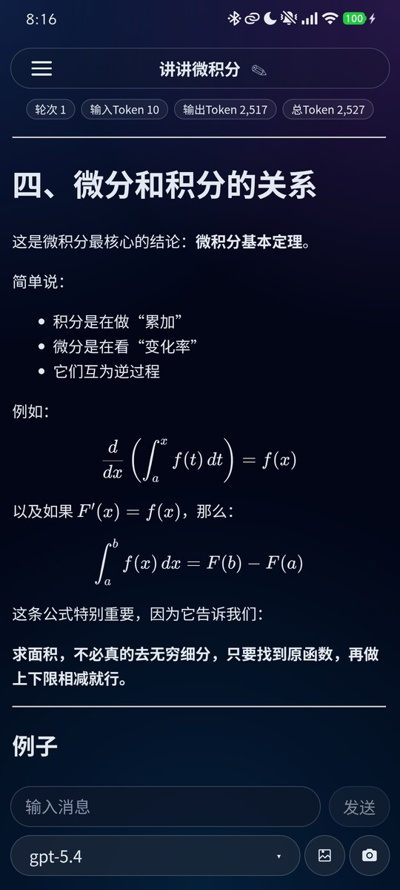
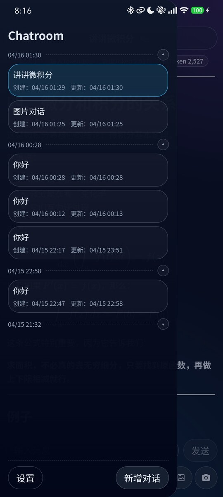
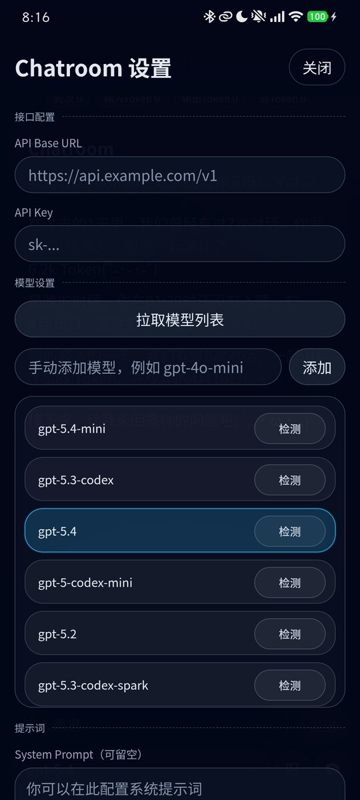

<h1 align="center">ChatroomAI</h1>

<p align="center">
  面向手机场景的 AI 聊天应用。<br />
  支持 GPT 兼容 API、多会话管理、图片输入、Markdown / LaTeX 渲染，以及完整的对话编辑能力。
</p>

<p align="center">
  <a href="https://github.com/Dandwan/ChatroomAI/releases/latest">
    
  </a>
  
  
</p>

<p align="center">
  <a href="#下载">下载</a> ·
  <a href="#功能特性">功能特性</a> ·
  <a href="#界面预览">界面预览</a> ·
  <a href="#快速开始">快速开始</a> ·
  <a href="#技术栈">技术栈</a>
</p>

<p align="center">
  
</p>

## 下载

### Android

- [查看最新 Release](https://github.com/Dandwan/ChatroomAI/releases/latest)
- [下载 Android APK（v1.1.1）](https://github.com/Dandwan/ChatroomAI/releases/download/v1.1.1/ChatroomAI-v1.1.1-android-release.apk)

## 功能特性

### 聊天体验

- **多会话管理**：支持新建会话、历史会话切换、自动命名和手动重命名。
- **对话编辑完整**：支持复制、编辑、重新生成，以及按轮次修改后续上下文。
- **移动端优先布局**：界面围绕手机单手使用场景设计，输入区和模型切换更贴近高频操作。

### 模型与配置

- **GPT 兼容 API 接入**：支持自定义 API Base URL 和 API Key。
- **模型管理**：可拉取模型列表、手动添加模型，并逐个检测模型是否可用。
- **常用参数可调**：支持 System Prompt、Temperature、Top P、Max Tokens、Presence Penalty、Frequency Penalty。

### 内容能力

- **Markdown / LaTeX 渲染**：适合阅读结构化回答、代码片段和公式内容。
- **图片输入**：支持从相册选择图片，也支持直接拍照发送。
- **思考过程展示**：可在回答中查看模型思考内容的折叠区域。

### 数据与反馈

- **使用统计**：支持展示输入 Token、输出 Token、总 Token、首 Token 延迟和总耗时。
- **本地保存**：会话与设置默认保存在本地，重新打开后可以继续使用。
- **交互细节**：补齐抽屉、菜单、标题编辑等过渡动画，并加入触感反馈。

## 界面预览

<table>
  <tr>
    <td align="center" width="25%">
      
      <br />
      <strong>1. 主页面</strong>
    </td>
    <td align="center" width="25%">
      
      <br />
      <strong>2. 公式渲染</strong>
    </td>
  </tr>
  <tr>
    <td align="center" width="25%">
      
      <br />
      <strong>3. 历史对话选择</strong>
    </td>
    <td align="center" width="25%">
      
      <br />
      <strong>4. 设置页面</strong>
    </td>
  </tr>
</table>

## 快速开始

### 普通使用

1. 从 [Release 页面](https://github.com/Dandwan/ChatroomAI/releases/latest) 下载并安装 Android APK。
2. 打开设置页，填写你的 API Base URL 和 API Key。
3. 拉取模型列表，或者手动添加你要使用的模型。
4. 新建对话后就可以直接开始聊天。

## 技术栈

### 核心技术

- React 19
- Vite
- Capacitor 8 + Android
- Markdown / KaTeX
- GPT 兼容 API

### 本地运行

```bash
npm install
npm run dev
```

### 常用命令

```bash
npm run lint
npm run build
npm run android:build
```

Android Release 构建产物位于 `android/app/build/outputs/apk/release/`。
如果本地已经配置签名 keystore，执行 `npm run android:build` 时会直接生成已签名的 release APK。

## License

[LICENSE](./LICENSE)
